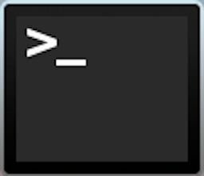
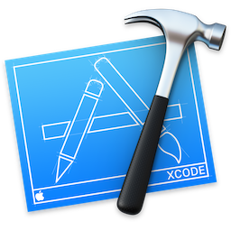

# macOS Developer Kit

These scripts/guide intends to setup an Apple Mac machine automatically.
This is mainly targeted to developers, but you don't need to be a power user to
install it, just follow the instructions.

This script was developed having macOS High Sierra (10.13) in consideration, so
I highly recommended that you install and disable SIP (System Integrity Protection)
first. Then, after the installation, re-activate it.

Take into account that the software presented in this guide was the one I need,
and your needs may differ from mine. Feel free to contribute to improve it!

# Table of Contents

- [Files](#files)
    - [`run.sh` script](#runsh-script)
        - [Running with Git](#running-with-git)
        - [Running without Git](#running-with-git)
        - [Usage](#usage)
    - [`macos.sh` script](#macossh-script)
    - [`basic.sh` script](#basicsh-script)
    - [`homebrew.sh` script](#homebrewsh-script)
    - [`applications.sh` script](#applicationssh-script)
        - [Text Editors](#text-editors)
        - [IDEs](#ides)
        - [Developer Tools](#developer-tools)
        - [Web Browsers](#web-browsers)
        - [File Sharing](#file-sharing)
        - [Communication](#communication)
        - [Utilities](#utilities)
    - [`plugins.sh` script](#pluginssh-script)
        - [Atom Plugins](#atom-plugins)
        - [Sublime Text Plugins](#sublime-text-plugins)
        - [Vim Plugins](#vim-plugins)
    - [`defaults.sh` script](#defaultssh-script)
    - [`dotfiles.sh` script](#dotfilessh-script)
- [Recommendations](#recommendations)
- [Credits](#credits)

# Files

- [`run.sh` script](#runsh-script)
    - Runs the overall configuration files and provides the user with a menus
    to choose which settings to apply.
- [`macos.sh` script](#macossh-script)
    - Updates macOS to the more recent available update.
- [`basic.sh` script](#basicsh-script)
    - Cleans up some directories and sets up local environment variables.
- [`homebrew.sh` script](#homebrewsh-script)
    - Provides a command line interface for installation and management
    of macOS packages.
- [`applications.sh` script](#applicationssh-script)
    - Installs applications via Homebrew Cask.
- [`plugins.sh` script](#pluginssh-script)
    - Installs extensions for Atom IDE.
- [`defaults.sh` script](#defaultssh-script)
    - Applies system and application default configurations.
- [`dotfiles.sh` script](#dotfilessh-script)
    - Downloads and configures `dotfiles` for Bash, Vim, Git, etc., configuration.

## `run.sh` script

  
   

### Running with Git

If you have already `git` installed, just open a terminal window and execute the following:

    git clone git://github.com/pbmartins/macOS-dev-kit.git
    cd macOS-dev-kit
    ./run.sh

### Running without Git

Otherwise, open a terminal window and execute the following:

    mkdir macOS-dev-kit
    cd macOS-dev-kit
    curl -#L https://github.com/pbmartins/macos-dev-kit/tarball/master | tar -xzv --strip-components 1 --exclude={README.md,LICENSE}
    ./run.sh

### Usage

You can edit any of the `*.sh` files in the `scripts` folder to your liking
and then open a terminal window to execute the following command:

    ./run.sh

Running the run.sh script will present the following options:

    Setup:
        b:   Apply basic system settings.
        h:   Install Homebrew software.
        ha:  Install ALL Homebrew software.
        a:   Install application software (Homebrew and Cask required).
        aa:  Install ALL application software (Homebrew and Cask required).
        x:   Install application (Atom, Sublime Text) extensions.
        d:   Apply OS and software defaults.
        f:   Apply dotfiles.
        i:   Install everything (i.e. executes all options, listed above, top to bottom).
    Manage:
        C:  Caffeinate machine.
        q:  Quit/Exit.

Choose option 'i' to run all install tasks or select a specific option to
run a single task. Each task is designed to be re-run if necessary.
This can also be handy for performing upgrades,
re-running a missing/failed install, etc.

It is recommended that you restart the machine once all install tasks
have been completed.

## `macos.sh` script

  
   

This script prepares your macOS, updating it to the latest release version
and installing XCode Command Line Utilities.

Note that this script takes into account that you have **at least** macOS
El Capitan installed (10.11), but it's optimised for macOS High Sierra (10.13).

It's also noteworthy that this is the **only script that is run automatically**.

## `basic.sh` script

This scripts cleans up your Downloads and Documents folders and configures your
machine name, both presented locally and to the network.

## `homebrew.sh` script

  
   

[Homebrew](https://brew.sh) is the missing packet manager from macOS. This
command line utility lets you install any kind of binary to your machine and
it's extremely useful for developers.

Besides installing Homebrew, `homebrew.sh` will also install the
following packages:

- [GNU Coreutils](https://www.gnu.org/software/coreutils)
- [moreutils](https://joeyh.name/code/moreutils/)
- [GNU Findutils](https://www.gnu.org/software/findutils/)
- [Bash](https://www.gnu.org/software/bash)
- [Bash Completion](http://bash-completion.alioth.debian.org)
- [homebrew-command-not-found](https://github.com/Homebrew/homebrew-command-not-found)
- [GNU Grep](https://www.gnu.org/software/grep/)
- [OpenSSL](https://openssl.org)
- [Homebrew Cask](https://caskroom.github.io)

Although the previously mentioned packages are installed automatically, the
following are optional:

    
Click to see all packages

 - [GNU adns](https://www.chiark.greenend.org.uk/~ian/adns/)
 - [asciinema](https://asciinema.org)
 - [GNU Autoconf](https://www.gnu.org/software/autoconf/)
 - [GNU Automake](https://www.gnu.org/software/automake/)
 - [GNU Binutils](https://www.gnu.org/software/binutils/)
 - [CMake](https://www.cmake.org/)
 - [Curl](https://curl.haxx.se/)
 - [DnscryptProxy](https://dnscrypt.org/)
 - [Docker](https://www.docker.com/)
 - [Doxygen](http://www.doxygen.org/)
 - [exiv2](http://www.exiv2.org)
 - [ffmpeg](https://ffmpeg.org/)
 - [Fontconfig](https://wiki.freedesktop.org/www/Software/fontconfig/)
 - [GCC](https://gcc.gnu.org)
 - [GDBM](http://www.gnu.org.ua/software/gdbm/)
 - [Ghex](https://wiki.gnome.org/Apps/Ghex)
 - [Git](http://git-scm.com)
 - [Git-LFS](http://git-scm.com)
 - [GPAC](https://gpac.wp.mines-telecom.fr/)
 - [GPG](https://www.gnupg.org)
 - [Graphviz](http://graphviz.org)
 - [hr](https://github.com/LuRsT/hr)
 - [htop](https://hisham.hm/htop/)
 - [HTTPie](https://github.com/jkbrzt/httpie)
 - [iperf3](https://github.com/esnet/iperf)
 - [IProute2mac](https://github.com/brona/iproute2mac)
 - [Minicom](https://alioth.debian.org/projects/minicom/)
 - [MongoDB](https://www.mongodb.org/)
 - [MySQL](https://www.mysql.com)
 - [Namebench](https://code.google.com/p/namebench)
 - [Network Grep](http://ngrep.sourceforge.net)
 - [Nmap](https://github.com/brona/iproute2mac)
 - [Node.js](http://nodejs.org)
 - [NTFS-3G](http://www.tuxera.com/community/open-source-ntfs-3g/)
 - [NumPy](http://www.numpy.org/)
 - [Peco](https://github.com/peco/peco)
 - [Perl](https://www.perl.org/)
 - [pkg-config](https://www.freedesktop.org/wiki/Software/pkg-config)
 - [Pipe Viewer](http://www.ivarch.com/programs/pv.shtml)
 - [Python](https://www.python.org)
 - [Python 3](https://www.python.org)
 - [rbenv](https://github.com/sstephenson/rbenv)
 - [rbenv-vars](https://github.com/sstephenson/rbenv-vars)
 - [rbenv-build](https://github.com/sstephenson/ruby-build)
 - [ShellCheck](https://github.com/koalaman/shellcheck)
 - [SQLite](https://www.sqlite.org)
 - [telnet](https://opensource.apple.com/)
 - [Tree](http://mama.indstate.edu/users/ice/tree)
 - [Vim](http://www.vim.org)
 - [wget](https://www.gnu.org/software/wget/)
 - [x264](https://www.videolan.org/developers/x264.html)

## `applications.sh` script

  
   

[Homebrew-Cask](https://caskroom.github.io) extends Homebrew and brings
its elegance, simplicity, and speed to macOS applications and large binaries alike.

Just a quick explanation of the logos:

 means **open source**;
 means **free** to use,
or **free** personal license;
 means **recommended** app;
 means **App store** hyperlink;

This scripts will install the following macOS applications:

### Text Editors

- [Atom](https://atom.io/) - A hackable text editor for the 21st century made by GitHub.
Check out [Atom Plugins](#atom-plugins). 
 
- [MacVim](https://github.com/b4winckler/macvim) - A highly configurable text
editor built to make creating and changing any kind of text very efficient,
[Vim Plugins](#vim-plugins). 
 
- [Sublime Text](https://atom.io/) - A sophisticated text editor for code,
markup and prose. You'll love the slick user interface, extraordinary features
and amazing performance. Check out [Sublime Text Plugins](#sublime-text-plugins).
 

### IDEs

- [IntelliJ IDEA](https://www.jetbrains.com/idea/) - A powerful Java IDE (Free for Students).

- [PyCharm](https://www.jetbrains.com/pycharm) - A powerful Python IDE
(Free for Students).
- [CLion](https://www.jetbrains.com/clion) - A powerful C/C++ IDE (Free for Students).
- [WebStorm](https://www.jetbrains.com/webstorm) - The smartest JavaScript IDE
by JetBrains (Free for Students). 

### Developer Tools

- [Dash](https://kapeli.com/dash) - Awesome API documentation browser
and code snippet manager. 

- [Docker CE](https://www.docker.com/) - App for building, debugging,
and testing Dockerized apps on a Mac. 

- [Docker Toolbox](https://www.docker.com/) - Docker VM.

- [FileZilla](https://filezilla-project.org/) - A free software, cross-platform
FTP application. Supports FTP, SFTP and FTPS (FTP over SSL/TLS).
 
- [GNS3](http://www.gns3.com) - Network virtualisation app.
 
- [iTerm](http://www.iterm2.com/) - iTerm2 is an amazing terminal emulator for macOS.
 

- [JavaSDK](http://www.oracle.com/technetwork/java/javase/index.html) -
Java Software Development Kit. 
- [MacTeX](https://www.tug.org/mactex) - An integrated writing environment
for creating LaTeX documents. 
- [Meld](http://meldmerge.org) - Visual diff and merge tool targeted at developer.
 
- [Vagrant](https://www.vagrantup.com) - A tool for building and distributing
development environments. 

- [VirtualBox](https://www.virtualbox.org) - A powerful x86 and AMD64/Intel64
virtualization product. 

- [TUNTAP](http://tuntaposx.sourceforge.net) - Provides kernel extensions for
macOS that allow to create virtual network interfaces.
 
- [XQuartz](https://www.xquartz.org) - X.Org X Window System that runs on macOS.
 

### Web Browsers

- [Google Chrome](http://www.google.com/chrome) - Chrome, produced by Google.

- [Firefox](http://www.mozilla.com/en-US/firefox) - Meet Firefox Quantum.
Fast for good. a free, open-source web browser developed by the Mozilla
Foundation. 

- [Opera](http://www.opera.com/) - Provides a built-in ad blocker, battery saver
and free VPN. 

### File Sharing

- [Dropbox](https://www.dropbox.com) -  A file hosting service that offers
cloud storage and file synchronization with collaborative edit features.

- [Google Backup and Sync](https://www.google.com/drive/download/backup-and-sync/) -
The new version of Google Drive app, by Google.
 

### Communication

- [Franz](https://meetfranz.com) - An Electron based, multi-protocol wrapper
for web-based chat client. One application, 23 messenger services.

- [Skype](http://www.skype.com) - A cross-platform application that provides
video chat and voice call services. Users can exchange images, text, video
and any other digital documents. 
- [Slack](https://slack.com) - Awesome tool for team collaboration and communication.
 

### Utilities

- [App Cleaner](http://www.freemacsoft.net/appcleaner) - A small application
which allows you to thoroughly uninstall unwanted apps.
 
- [Flux](https://justgetflux.com) - Makes the color of your computer's display
adapt to the time of day, warm at night and like sunlight during the day.
 
- [FUSE for macOS](https://osxfuse.github.io) - FUSE for macOS allows you to
extend macOS's native file handling capabilities via third-party file systems.

 
- [iStat Menus](https://bjango.com/mac/istatmenus/) -
An advanced Mac system monitor on the menubar.
- [Little Snitch](https://www.obdev.at/products/littlesnitch/index.html) -
Firewall that lets you control all inbound and outbound connections.

- [Spectacle](https://www.spectacleapp.com/) - Move and resize windows with simple
and customisable keyboard shortcuts. 
 
- [Spotify](https://www.spotify.com) - Streaming music service.

- [Stremio](https://www.stremio.com) - Stremio is a one-stop hub
for video content aggregation. 

- [VLC](http://www.videolan.org) - A free, open-source, cross-platform multimedia
player as well as framework that plays most multimedia files, DVDs, Audio CDs,
VCDs and various streaming protocols.
 
- [The Unarchiver](http://wakaba.c3.cx/s/apps/unarchiver.html) - Unarchive many
different kinds of archive files. 

- [Transmission](http://www.transmissionbt.com) - A Fast, Easy,
Free BitTorrent Client. 
 

## `plugins.sh` script

### Atom Plugins

  
   

Atom is a great text editor, but this script will install some plugins that
will make it even better:

- [atom-beautify](https://atom.io/packages/atom-beautify) - Beautify HTML, CSS,
JavaScript, PHP, Python, Ruby, Java, C, C++, C#, Objective-C, CoffeeScript,
TypeScript, Coldfusion, SQL, and more in Atom.
- [ex-mode](https://atom.io/packages/ex-mode) - ex-mode for Atom's vim-mode.
- [file-icons](https://atom.io/packages/file-icons) - Assign file extension icons
and colors for improved visual grep.
- [open-terminal-here](https://atom.io/packages/open-terminal-here) - Open the
Terminal (OSX, Linux) or Command Prompt (Windows) in the given directory via
context menu or keyboard shortcut.
- [vim-mode-plus](https://atom.io/packages/vim-mode-plus) - Add vim modal control.

### Sublime Text Plugins

  
   

Make Sublime Text even better with this plugins:

- [NeoVintageous](https://github.com/NeoVintageous/NeoVintageous) -
An advanced Vim emulation layer for Sublime Text.
- [One Dark UI](https://github.com/atom/one-dark-ui) -
Atom One Dark theme for Sublime Text.

### Vim Plugins

  
   

If you opt to download my `dotfiles`, the following Vim plugins will be installed:

- [Vundle.Vim](https://github.com/VundleVim/Vundle.vim) - Vim plugin manager.
- [vim-snippets](https://github.com/honza/vim-snippets) - Snippets for various
programming languages.
- [lightline.vim](https://github.com/itchyny/lightline.vim) - A light and
configurable statusline/tabline plugin for Vim.
- [fugitive.vim](https://github.com/tpope/vim-fugitive) - Git wrapper for Vim.
- [NERDTree](https://github.com/scrooloose/nerdtree) - A tree explorer plugin for Vim.
- [jedi-vim](https://github.com/davidhalter/jedi-vim) - Python autocompletion with Vim.

## `defaults.sh` script

  
   

This script will apply a series of default configurations to:

- System - changing the UI, sleep times, etc.
- Trackpad, mouse, keyboard, Bluetooth accessories, WiFi and input devices.
- Dock, Dashboard, and Menu Bar - changing Dock size, animations, etc.
- Finder - changing file display, etc.
- Web Browsers - Safari and Chrome.
- Mail app.
- Spotlight - improving the general privacy of the system.
- Terminal and iTerm 2 - changing the theme and some configs.
- Time Machine.
- Address Book, Dashboard, iCal, TextEdit, Printer and Disk Utility.
- Mac App Store.
- Transmission.

Please check the script for further information about each specific config.

## `dotfiles.sh` script

  
   

Downloads and applies my personal `dotfiles`, from this [repository](https://github.com/pbmartins/dotfiles).
Feel free to explore and change any of the configurations. You may also contribute
to my `dotfiles` repo, any help and suggestion is welcome!

# Recommendations

I also recommend that you check out the following repositories, if you want to
improve the general privacy and security of your Mac:

- [macOS Security and Privacy Guide](https://github.com/drduh/macOS-Security-and-Privacy-Guide) -
Collection of thoughts on and techniques for securing a modern Apple Mac computer
("MacBook") using macOS (formerly known as OS X) version 10.12 "Sierra",
as well as steps to generally improving privacy.
- [macOS Home Call Drop](https://github.com/karek314/macOS-home-call-drop) -
Simple shell script to fix macOS privacy issues and remove mostly useless
macOS calls to Cupertino.

# Credits

Based on the macOS guide developed by [Brooke Kuhlmann](https://www.alchemists.io)
at [Alchemists](https://www.alchemists.io).
I adapted his scripts to make it my own and install my preferences and software I mainly use.
The documentation was mainly based on [jaywcjlove](https://github.com/jaywcjlove)
[Awesome Mac](https://github.com/jaywcjlove/awesome-mac) repository and
[Donne Martin](https://github.com/donnemartin)
[dev-setup](https://github.com/donnemartin/dev-setup) repository.

Feel free to suggest any software, binary or package. Hope you enjoy it!
Pedro Martins
